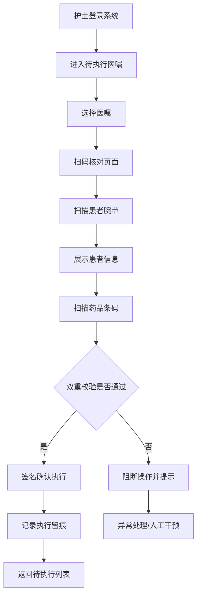

## 1. 产品概述

住院医嘱闭环核对终端网页应用，供病区护士、责任医生和药师在床旁与护士站共同核对医嘱，实现医嘱执行全过程的闭环管理，降低医疗差错率，提升护理安全。

- 解决问题：传统医嘱核对流程依赖人工、易出错、缺乏全程留痕，存在漏执行、错执行风险
- 目标用户：病区护士（主要操作者）、责任医生（审核查看）、药师（用药审核）
- 市场价值：提升医院护理安全水平，符合等级医院评审要求，减少医疗纠纷

## 2. 核心功能

### 2.1 用户角色

| 角色 | 登录方式 | 核心权限 |
|------|----------|----------|
| 病区护士 | 工号登录/工牌扫码 | 查看待执行医嘱、扫码核对、执行确认、异常上报、交接确认、批量操作 |
| 责任医生 | 工号登录 | 查看医嘱执行状态、查看退回医嘱、审核异常处理、签名确认 |
| 药师 | 工号登录 | 用药审核、冲突医嘱标注、药品信息核查、异常干预 |

### 2.2 功能模块

1. **待执行医嘱页面**：医嘱自动分组、时间排序、执行提醒、漏执行提示、冲突标红、批量选择
2. **扫码核对页面**：患者腕带扫码、药品条码扫码、双重身份核对、患者信息展示、执行确认
3. **执行记录页面**：执行留痕查询、按状态/时间/人员筛选、执行详情查看、签名验证
4. **异常处理页面**：拒绝原因登记、补录说明、异常分类、退回/暂停医嘱、审核流程
5. **交接确认页面**：未闭环项目一览、交接清单、交接班签名、接收确认

### 2.3 页面详情

| 页面名称 | 模块名称 | 功能描述 |
|----------|----------|----------|
| 待执行医嘱 | 患者选择卡 | 当前病区患者列表，显示床号、姓名、待执行数量、预警状态 |
| 待执行医嘱 | 医嘱分组区 | 按时间（今日/待执行/超时）、按类型（药品/治疗/检查）自动分组 |
| 待执行医嘱 | 医嘱列表 | 显示医嘱内容、执行时间、状态、优先级、冲突标记、操作按钮 |
| 待执行医嘱 | 批量操作栏 | 全选/反选、批量执行、批量标记、批量交接 |
| 待执行医嘱 | 提醒中心 | 漏执行闪烁提醒、超时红色警示、即将执行黄色提醒 |
| 扫码核对 | 腕带扫码区 | 扫码输入框、手动输入、摄像头扫码模拟 |
| 扫码核对 | 患者信息卡 | 床号、姓名、性别、年龄、住院号、过敏史、诊断信息 |
| 扫码核对 | 药品核对区 | 药品名称、规格、剂量、用法、条码比对结果 |
| 扫码核对 | 双重校验 | 腕带+药品双重核对结果展示，一致通过，不一致阻断 |
| 扫码核对 | 执行确认 | 执行前最后确认、签名输入、执行时间记录 |
| 执行记录 | 筛选条件区 | 时间范围、医嘱类型、执行状态、执行人、患者筛选 |
| 执行记录 | 记录列表 | 执行时间、医嘱内容、执行人、执行状态、异常标记 |
| 执行记录 | 详情弹窗 | 完整执行流程、操作时间线、签名验证 |
| 异常处理 | 异常列表 | 异常医嘱、异常类型、异常时间、异常状态、处理状态 |
| 异常处理 | 拒绝原因登记 | 预设原因选项、自定义原因、备注说明 |
| 异常处理 | 补录说明 | 补录时间、补录原因、补录说明、补录人签名 |
| 异常处理 | 退回审核 | 医生审核、药师审核、处理意见 |
| 交接确认 | 未闭环一览 | 未执行、执行中、异常中、待审核医嘱统计与列表 |
| 交接确认 | 交接清单 | 待交接项目列表、交接说明、注意事项 |
| 交接确认 | 签名确认 | 交班人签名、接班人签名、交接时间 |
| 交接确认 | 交接记录 | 历史交接记录查询 |

## 3. 核心流程

### 3.1 医嘱执行主流程

护士登录系统 → 进入待执行医嘱页面 → 选择患者/查看全部 → 系统自动按时间排序分组 → 点击扫码核对 → 扫描患者腕带 → 系统展示患者信息 → 扫描药品条码 → 系统双重校验 → 校验通过 → 签名确认执行 → 系统记录执行留痕 → 返回待执行列表

### 3.2 异常处理流程

发现医嘱异常 → 点击异常处理 → 选择异常类型 → 登记拒绝原因/补录说明 → 提交 → 通知责任医生/药师审核 → 审核通过 → 医嘱退回或修正 → 审核不通过 → 退回重新处理

### 3.3 交接班流程

交班护士进入交接确认 → 系统自动汇总未闭环项目 → 生成交接清单 → 交班护士核对并签名 → 接班护士登录 → 确认交接项目 → 签名接收 → 系统记录交接时间与内容

## 4. 用户界面设计

### 4.1 设计风格

- **主色调**：医疗蓝（#1E88E5）作为主色，代表专业与信任
- **辅助色**：紧急红（#E53935）用于冲突/异常，提醒黄（#FB8C00）用于即将执行，成功绿（#43A047）用于已执行
- **中性色**：深灰（#263238）文字，中灰（#78909C）次要信息，浅灰（#ECEFF1）分割线/背景
- **按钮风格**：圆角矩形（8px），主按钮填充色，次按钮描边，悬停有轻微阴影与颜色加深
- **字体**：中文字体使用「思源黑体 / Noto Sans SC」，英文字体使用「Roboto Mono」等宽字体展示编号和条码
- **布局风格**：左右分栏式布局，左侧导航栏 + 顶部状态栏 + 右侧主内容区，卡片式模块划分
- **图标风格**：使用 Lucide 线性图标，保持统一的 24px 尺寸和线条风格

### 4.2 页面设计概述

| 页面名称 | 模块名称 | UI 元素 |
|----------|----------|----------|
| 待执行医嘱 | 患者选择卡 | 横向滚动卡片、床号大字、姓名、待执行数量角标、预警色边框 |
| 待执行医嘱 | 医嘱分组区 | Tab 切换标签、分组计数徽章、时间轴分隔 |
| 待执行医嘱 | 医嘱列表 | 列表卡片、优先级标签、状态徽章、冲突红色底纹、执行按钮、动画提示 |
| 扫码核对 | 腕带扫码区 | 大号扫码输入框、扫码图标按钮、边框呼吸动画、摄像头模拟按钮 |
| 扫码核对 | 患者信息卡 | 大头像占位、信息网格布局、过敏史红色标签、诊断信息 |
| 扫码核对 | 双重校验 | 进度步骤条、对号/叉号图标、绿色通过/红色阻断背景 |
| 执行记录 | 记录列表 | 时间轴式布局、状态色竖线、详情展开箭头 |
| 异常处理 | 异常列表 | 异常类型标签、处理状态进度、操作按钮组 |
| 交接确认 | 未闭环一览 | 大号统计卡片、数据大屏风格、颜色编码、列表切换 |
| 交接确认 | 签名区 | 签名画布、签名预览、时间戳 |

### 4.3 响应式设计

- 桌面端优先设计，适配 1366×768 及以上分辨率（护士站终端）
- 床旁平板适配 1024×768，优化触控区域（最小 44px 点击热区）
- 横向布局为主，考虑终端设备可能横屏使用
- 关键操作按钮（扫码、确认、签名）放大处理，适合戴手套操作

## 5. 交互体验要点

### 5.1 护士床旁操作优化

- 核心操作路径不超过 3 步点击
- 大按钮、大字体，适合手持平板操作
- 扫码优先，减少手动输入
- 关键确认采用双重验证（如长按确认）
- 语音播报提醒（可选）

### 5.2 医生查看优化

- 状态一目了然：已执行绿色、退回红色、待执行灰色
- 支持按患者、按时间、按状态多维度筛选
- 异常医嘱置顶显示
- 一键跳转到患者详情

### 5.3 交接班优化

- 未闭环项目用醒目的数字卡片展示
- 红色闪烁标注超时未执行项目
- 交接清单自动生成，支持补充说明
- 双人签名后锁定，不可篡改
