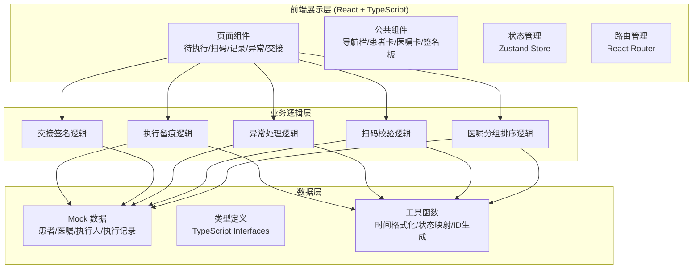

## 1. 架构设计



## 2. 技术描述

- **前端框架**：React@18 + TypeScript@5
- **构建工具**：Vite@5
- **样式方案**：TailwindCSS@3
- **状态管理**：Zustand@4
- **路由管理**：react-router-dom@6
- **图标库**：lucide-react@latest
- **后端**：无后端，前端 Mock 数据模拟
- **数据库**：无数据库，使用前端内存数据 + localStorage 持久化

## 3. 路由定义

| 路由 | 页面 | 说明 |
|------|------|------|
| `/` | 待执行医嘱 | 默认首页，展示当前病区待执行医嘱列表 |
| `/orders/pending` | 待执行医嘱 | 同首页，医嘱分组、排序、批量操作 |
| `/scan` | 扫码核对 | 腕带扫码、药品核对、双重校验、执行确认 |
| `/records` | 执行记录 | 执行留痕查询、筛选、详情查看 |
| `/exceptions` | 异常处理 | 异常列表、拒绝原因、补录说明、审核 |
| `/handover` | 交接确认 | 未闭环一览、交接清单、双人签名 |

## 4. 数据模型

### 4.1 类型定义

```typescript
// 患者信息
interface Patient {
  id: string;
  bedNo: string;
  name: string;
  gender: '男' | '女';
  age: number;
  hospitalNo: string;
  diagnosis: string;
  allergies: string[];
  ward: string;
  wristbandCode: string;
}

// 医嘱类型
type OrderType = '药品' | '治疗' | '检查' | '护理' | '手术';

// 医嘱状态
type OrderStatus = '待执行' | '执行中' | '已执行' | '已退回' | '已暂停' | '异常' | '漏执行';

// 优先级
type Priority = '普通' | '紧急' | '特级';

// 医嘱信息
interface Order {
  id: string;
  patientId: string;
  orderNo: string;
  type: OrderType;
  content: string;
  specification?: string;
  dosage?: string;
  usage?: string;
  barcode?: string;
  plannedTime: string;
  createTime: string;
  doctorName: string;
  pharmacistName?: string;
  priority: Priority;
  status: OrderStatus;
  isConflict: boolean;
  conflictReason?: string;
  remark?: string;
  groupId?: string;
}

// 执行记录
interface ExecutionRecord {
  id: string;
  orderId: string;
  patientId: string;
  executorId: string;
  executorName: string;
  executeTime: string;
  status: OrderStatus;
  verifyPatient: boolean;
  verifyDrug: boolean;
  signature: string;
  remark?: string;
  operationLog: OperationLog[];
}

// 操作日志
interface OperationLog {
  time: string;
  operator: string;
  action: string;
  detail?: string;
}

// 异常记录
interface ExceptionRecord {
  id: string;
  orderId: string;
  patientId: string;
  type: '拒绝执行' | '补录' | '暂停' | '冲突';
  reason: string;
  customReason?: string;
  description: string;
  reporterId: string;
  reporterName: string;
  reportTime: string;
  status: '待审核' | '已通过' | '已驳回';
  reviewerId?: string;
  reviewerName?: string;
  reviewTime?: string;
  reviewOpinion?: string;
}

// 交接记录
interface HandoverRecord {
  id: string;
  shift: '早班' | '中班' | '晚班';
  handoverTime: string;
  outgoingNurseId: string;
  outgoingNurseName: string;
  outgoingSignature: string;
  incomingNurseId: string;
  incomingNurseName: string;
  incomingSignature: string;
  pendingOrders: string[];
  remarks: string;
}

// 用户
interface User {
  id: string;
  name: string;
  role: '护士' | '医生' | '药师';
  jobNo: string;
  ward: string;
  signature: string;
}
```

### 4.2 状态管理结构（Zustand Store）

```typescript
interface AppState {
  currentUser: User | null;
  patients: Patient[];
  orders: Order[];
  executionRecords: ExecutionRecord[];
  exceptionRecords: ExceptionRecord[];
  handoverRecords: HandoverRecord[];
  
  // Actions
  login: (jobNo: string) => void;
  logout: () => void;
  getOrdersByPatient: (patientId: string) => Order[];
  getPendingOrders: () => Order[];
  getOrdersByStatus: (status: OrderStatus) => Order[];
  groupAndSortOrders: (orders: Order[]) => GroupedOrders;
  executeOrder: (orderId: string, executorId: string, signature: string) => void;
  reportException: (record: Omit<ExceptionRecord, 'id' | 'reportTime' | 'status'>) => void;
  createHandover: (record: Omit<HandoverRecord, 'id' | 'handoverTime'>) => void;
  verifyWristband: (code: string) => Patient | null;
  verifyDrugBarcode: (orderId: string, barcode: string) => boolean;
}
```

## 5. 项目目录结构

```
src/
├── components/          # 公共组件
│   ├── Layout.tsx       # 布局组件（导航+内容区）
│   ├── Sidebar.tsx      # 左侧导航栏
│   ├── TopBar.tsx       # 顶部状态栏
│   ├── PatientCard.tsx  # 患者卡片
│   ├── OrderCard.tsx    # 医嘱卡片
│   ├── StatusBadge.tsx  # 状态徽章
│   ├── SignaturePad.tsx # 签名画板
│   ├── ScanInput.tsx    # 扫码输入框
│   ├── ConfirmDialog.tsx# 确认弹窗
│   └── TimeAxis.tsx     # 时间轴组件
├── pages/               # 页面组件
│   ├── PendingOrders.tsx   # 待执行医嘱
│   ├── ScanVerify.tsx      # 扫码核对
│   ├── ExecutionRecords.tsx# 执行记录
│   ├── ExceptionHandling.tsx# 异常处理
│   └── HandoverConfirm.tsx # 交接确认
├── store/               # 状态管理
│   └── index.ts         # Zustand Store
├── types/               # 类型定义
│   └── index.ts
├── data/                # Mock 数据
│   ├── patients.ts
│   ├── orders.ts
│   ├── records.ts
│   └── users.ts
├── utils/               # 工具函数
│   ├── time.ts
│   ├── order.ts
│   └── id.ts
├── App.tsx
├── main.tsx
└── index.css
```

## 6. 核心算法与逻辑

### 6.1 医嘱自动分组排序算法

```
1. 按时间维度分组：
   - 超时未执行（plannedTime < now 且 status=待执行）
   - 即将执行（now < plannedTime < now+30min）
   - 今日待执行（plannedTime 在今日内）
   - 后续待执行（plannedTime > 今日）

2. 组内排序规则：
   - 优先级：特级 > 紧急 > 普通
   - 时间：计划执行时间升序
   - 冲突医嘱置顶标红

3. 按医嘱类型二级分组
```

### 6.2 双重核对校验逻辑

```
腕带核对流程：
1. 扫描腕带条码 → 解析患者ID
2. 查询患者信息 → 展示患者基本信息+过敏史
3. 与当前医嘱的 patientId 比对

药品核对流程：
1. 扫描药品条码
2. 与医嘱关联的药品条码比对
3. 核对规格、剂量、用法

最终结果：
- 两项均通过 → 允许执行
- 任意一项不通过 → 阻断并弹窗提示，引导至异常处理
```

### 6.3 漏执行检测

```
- 定时轮询：每 60 秒检查一次待执行医嘱
- 判定规则：plannedTime 已过 5 分钟且状态仍为待执行
- 提示方式：列表项红色闪烁、顶部提醒条、声音提示（可选）
- 超时 30 分钟：自动标记为「漏执行」，需异常处理流程补录
```
